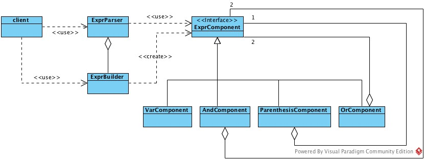

## Correzione compito Ingegneria del Software del 26/02/2016

Federico Maria Teotini  
Matricola 5306916

### Esercizio 1
Il class diagram che descrive come vengono composti i pattern Composite e Builder è il seguente.



Il Builder pattern è composto da:
- __ExprParser__ (Director)
- __ExprBuilder__ (ConcreteBuilder)
- __*ExprComponent*__ (Product)

Il Composite pattern è composto da:
- __*ExprComponent*__ (*Component*)
- __VarComponent__ (Leaf)
- __AndComponent__, __OrComponent__, __ParenthesisComponent__ (Composite)

Nel caso specifico della rappresentazione dell'espressione `(X AND Y) OR Z`, l'object diagram è:


Di seguito dei frammenti di codice significativi che riguardano il caso specifico precedente.
```java
public class ExprParser {
    private ExprBuilder builder;

    public ExprParser(ExprBuilder builder) {
        this.builder = builder;
    }

    public ExprComponent parse(String expr) {
        // parse the string and assign the boolean value
        // to the variables x, y, z

        ExprComponent xComponent = builder.buildVar(x);
        ExprComponent yComponent = builder.buildVar(y);
        ExprComponent and = builder.buildAnd(x, y);
        ExprComponent parenthesis = builder.buildParenthesis(and);
        return builder.buildOr(parenthesis, builder.buildVar(z));
    }
}
```
```java
public class ExprBuilder {

    public VarComponent buildVar(boolean value) {
        return new VarComponent(value);
    }

    public AndComponent buildAnd(ExprComponent firstOperator, ExprComponent secondOperator) {
        return new AndComponent(firstOperator, secondOperator);
    }

    public OrComponent buildOr(ExprComponent firstOperator, ExprComponent secondOperator) {
        return new OrComponent(firstOperator, secondOperator);
    }

    public ParenthesisComponent buildParenthesis(ExprComponent child) {
        return new ParenthesisComponent(child);
    }
}
```
```java
public class ParenthesisComponent extends ExprComponent {
    private ExprComponent child;

    public ParenthesisComponent(ExprComponent child) {
        this.child = child;
    }

    @Override
    public boolean getExpr() {
        return child.getExpr();
    }
}
```
```java
public class AndComponent extends ExprComponent {
    private final ExprComponent firstOperator;
    private final ExprComponent secondOperator;

    public AndComponent(ExprComponent firstOperator, ExprComponent secondOperator) {
        this.firstOperator = firstOperator;
        this.secondOperator = secondOperator;
    }

    @Override
    public boolean getExpr() {
        return firstOperator.getExpr() && secondOperator.getExpr();
    }
}
```
```java
public class VarComponent extends ExprComponent{
    private boolean value;

    public VarComponent(boolean value) {
        this.value = value;
    }

    @Override
    public boolean getExpr() {
        return value;
    }
}
```
Il `main()` che mette in vita gli oggetti è:
```java
public class Main {

    public static void main(String[] args) {
        ExprBuilder builder = new ExprBuilder();
        ExprParser parser = new ExprParser(builder);
        boolean result = parser.parse("(True and False) or True");

        // ------- Tests -------
        // il risultato del parsing dovrebbe essere True
        // il seguente test lo conferma
        if (result) {
            System.out.println("Ok");
        } else {
            System.out.println("Error");
        }
    }
}
```
### Esercizio 2

### Esercizio 3
Lo Use Case Diagram relativo alla descrizione del sistema è il seguente


e il relativo Class Diagram


Descrizione funzionale Use Cases
- Per inserire una prenotazione viene invocato il metodo `newReservation(Date, Citizen)` su un oggetto di tipo `Ambulatorio`. Il metodo accetta come parametri un `Date` e un `Citizen`. La `Reservation` sarà aggiunta alla mappa `reservationsMap` dell'`Agenda` dell'`Ambulatorio`.
- Per cancellare una data `Reservation`, si chiama il metodo `cancelReservation(Reservation)` su un oggetto `Ambulatorio` passandogli il riferimento alla `Reservation`.
- I `Citizen` che si sono prenotati dopo una certa data, vengono identificati tramite il metodo `getCitizen()` invocato su ogni `Reservation` della lista, la quale è stata ottenuta usando il metodo `getReservationsAfter(Date)` di un oggetto `Agenda` relativo allo specifico `Ambulatorio`. Tale oggetto è ritornato da `getAgenda()` di quell'`Ambulatorio`.
- Per verificare l'avvenuto pagamento del `Ticket`, prima viene selezionata la `Reservation` chiamando `getReservationBy(Ambulatorio, Date)` sull'istanza dello specifico `Citizen`; poi viene invocato il metodo `verifyTicketPayment()` sulla `Reservation` trovata.
- Se il pagamento è stato effettuato, il 'Citizen' viene registrato come accettato chiamando `acceptCitizen()` sulla relativa `Reservation`.
- Per acquisire dati statistici su ogni `Ambulatorio`, si trova la corrispondente `Agenda`, che è una `collection`, che espone diversi metodi per trovare, numerare, filtrare, etc. le `Reservation`; uno di questi è `getReservationsCount()`.
- Il sistema, ogni sera, seleziona le `Reservation` relative a 2 giorni dopo (48h) tramite uno dei metodi dell'`Agenda` di ogni `Ambulatorio`. Per ogni `Reservation` trovata si invoca il metodo `sendMemo()`.
- Ogni sera, il sistema seleziona le `Reservation` di quel giorno appena trascorso in cui il `Citizen` non si è presentato tramite il metodo `getTodayUnacceptedReservations()` di `Agenda` e, per ognuna, invoca 'forceTicketPayment()'.
